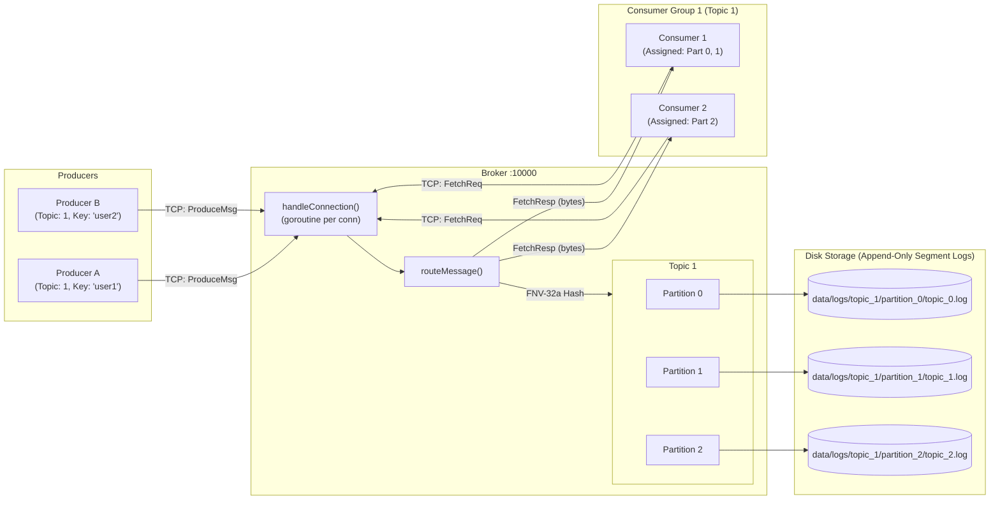
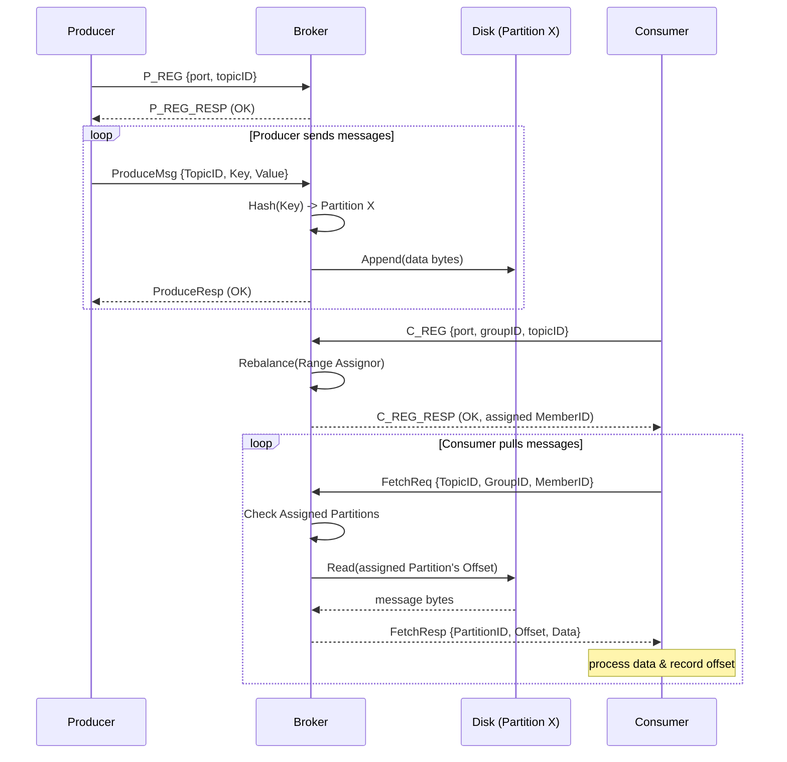

# gokafk

A distributed message broker inspired by Apache Kafka, built from scratch in Go. 

## Features
- **Append-Only Log Storage**: High-performance disk storage using segmented files with sparse memory indexing.
- **Partitioning System**: Topics are split into multiple partitions for high concurrency.
- **Key-based Routing**: Deterministic routing using FNV-32a hashing ensures messages with the same key go to the same partition.
- **Consumer Group Rebalancing**: Implements "Range Assignor" algorithm to distribute partitions evenly among connected consumers.
- **Custom Binary Protocol**: Lightweight custom TCP protocol using Big-Endian formatting, CRC32 checksum integration, and explicit correlation mapping.

## Architecture



## Message Flow



## Design Decisions

### Append-Only Log & Sparse Index
Data is written sequentially (append-only) instead of random updates. This yields 10-100x disk I/O performance. An in-memory sparse index tracks `[message_offset -> byte_position]` allowing for O(1) read lookups without scanning the file.

### Partitions & Key-Based Routing
Topics are sharded into partitions. Using `FNV-32a`, messages containing the same `Key` are consistently written to the same partition, guaranteeing ordered consumption per key while allowing horizontal scaling overall.

### Consumer Group Range Assignor
Consumers subscribing to the same `GroupID` share the topic workload. Partitions are evenly divided among consumers using a deterministic Range Assignor algorithm. When consumers join or leave, the group inherently rebalances to ensure zero starved partitions.

### Pull-Based Consumption
Consumers request (pull) data at their own pace, naturally applying backpressure. This removes the burden of tracking state from the broker, keeping it stateless and highly efficient.

## Usage

### Using Go

```bash
# Terminal 1 — Run broker
go run cmd/gokafk/main.go server

# Terminal 2 — Run producer (port=8000, topicID=1)
# Usage: gokafk producer <port> <topicID> [optional-key]
go run cmd/gokafk/main.go producer 8000 1 user_key

# Terminal 3 — Run consumer (port=0, topicID=1, groupID=1)
# Usage: gokafk consumer <port> <topicID> <groupID>
go run cmd/gokafk/main.go consumer 0 1 1
```

### Using Docker

```bash
# Build & run broker
docker compose up -d broker

# View logs
docker compose logs -f broker

# Stop
docker compose down
```

Or build manually:

```bash
# Build image
docker build -t gokafk:dev .

# Run broker
docker run -d --name gokafk-broker -p 10000:10000 gokafk:dev
```

### Run integration tests (Docker)

```bash
# Starts broker + KafkaJS test suite
docker compose up --build --abort-on-container-exit test-runner
```

## Project Structure

```
gokafk/
├── cmd/gokafk/main.go          # Entry point (server | producer | consumer)
├── pkg/
│   ├── client/                 # Public SDK Consumer/Producer TCP client
│   └── protocol/               # Binary codec (Marshal/Unmarshal, CRC32 verification)
├── internal/
│   ├── broker/                 # TCP server, grouping, partition & topic controllers
│   ├── config/                 # Default configurations and environments
│   ├── cli/                    # CLI logic for producer and consumer commands
│   └── storage/                # Disk storage layer (Segment, Sparse Index)
```

## Readmore

> [Wiki](https://gistcdn.githack.com/EricNguyen1206/e6395e9b4b6323f2125312dd8e80d60b/raw/index.html)

