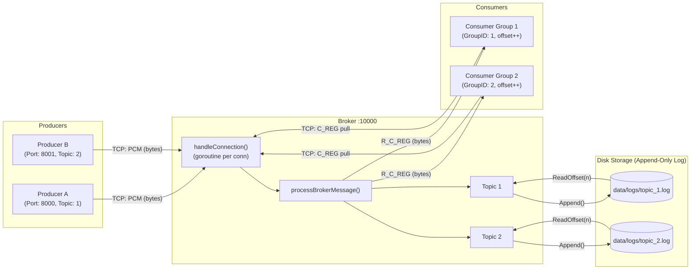
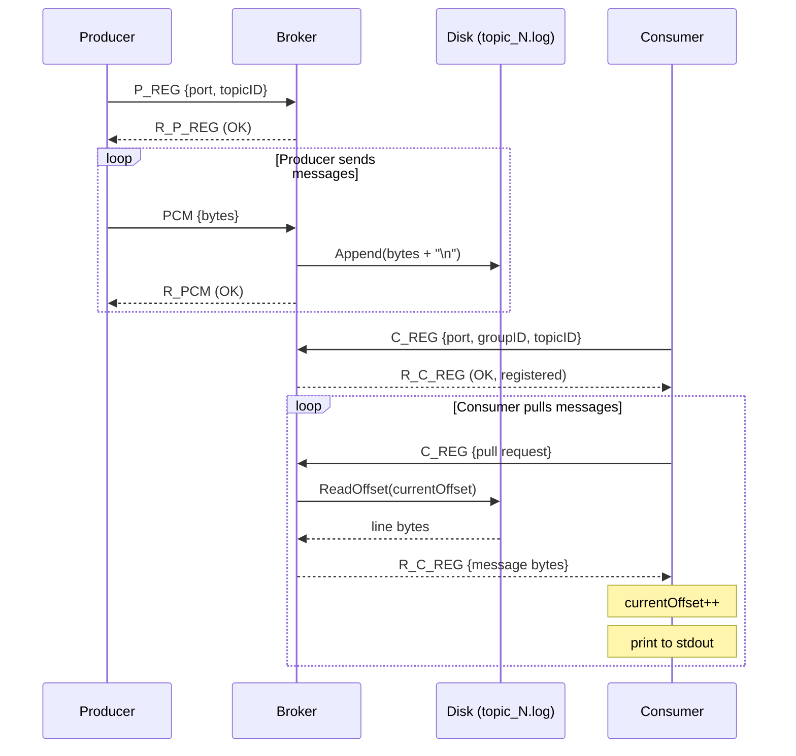

# gokafk

A distributed message broker inspired by Apache Kafka, built from scratch in Go.

## Architecture



## Message Flow



## Design Decisions

### Why Append-Only Log?
Kafka's core insight — ghi dữ liệu nối tiếp vào cuối file (append-only) thay vì cập nhật ngẫu nhiên. Lợi ích:
- **Hiệu năng ghi cao**: Sequential write nhanh hơn random write 10-100x trên ổ cứng.
- **Immutability**: Dữ liệu không bao giờ bị ghi đè, dễ debug và replay.
- **Offset-based reads**: Consumer chỉ cần lưu một số nguyên (offset) để biết đã đọc đến đâu.

### Why Pull-based Consumer?
Consumer chủ động kéo (pull) thay vì Broker đẩy (push). Lợi ích:
- **Backpressure tự nhiên**: Consumer chỉ kéo khi sẵn sàng, không bị quá tải.
- **Replay dễ dàng**: Consumer có thể reset offset về 0 để đọc lại toàn bộ log.
- **Stateless Broker**: Broker không cần theo dõi Consumer đang xử lý đến đâu.

### Why `sync.Mutex` on Broker?
Mỗi kết nối TCP chạy trong một Goroutine riêng biệt. Nhiều Producer/Consumer có thể đồng thời ghi vào `b.topics` gây race condition. `sync.Mutex` bảo vệ shared state này.

## Usage

```bash
# Terminal 1 — Run broker
go run cmd/gokafk/main.go server

# Terminal 2 — Run producer (port=8000, topicID=1)
go run cmd/gokafk/main.go producer 8000 1

# Terminal 3 — Run consumer (port=0, topicID=1, groupID=1)
go run cmd/gokafk/main.go consumer 0 1 1
```

## Project Structure

```
gokafk/
├── cmd/gokafk/main.go          # Entry point (server | producer | consumer)
├── internal/
│   ├── broker/
│   │   ├── broker.go           # TCP server, message routing, mutex
│   │   └── topic.go            # Topic state (producers, consumers, segment)
│   ├── consumer/
│   │   └── consumer.go         # Consumer TCP client, pull loop
│   ├── producer/
│   │   └── producer.go         # Producer TCP client, send loop
│   ├── message/
│   │   ├── message.go          # Binary protocol (parse & write)
│   │   ├── consumerRegisterMessage.go
│   │   └── producerRegisterMessage.go
│   └── storage/
│       ├── segment.go          # Append-only log (disk I/O)
│       └── segment_test.go     # Unit tests
└── data/logs/                  # Runtime log files (gitignored)
```
