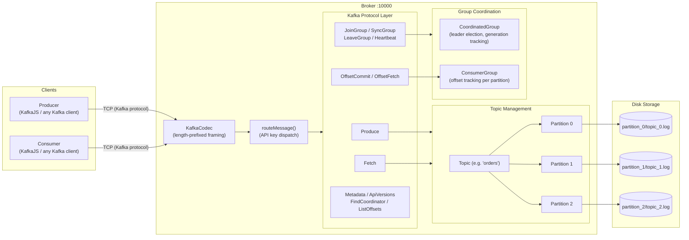
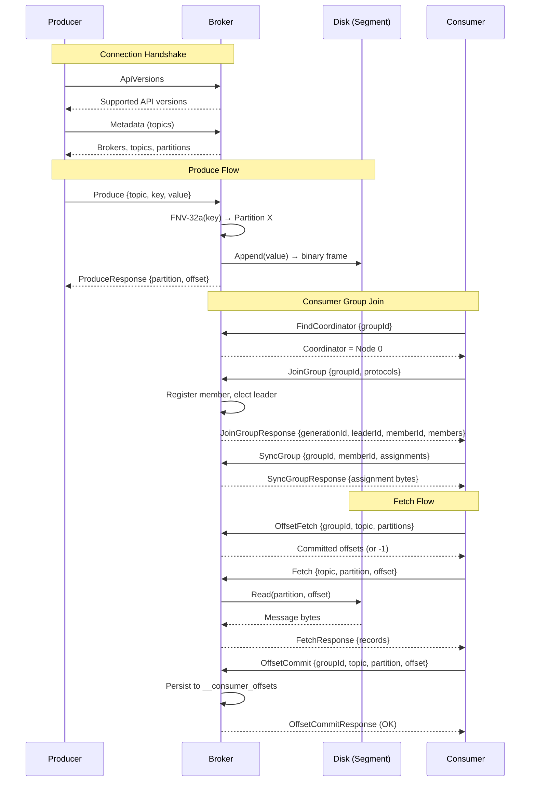

# gokafk

A Kafka-compatible message broker built from scratch in Go. Implements the real Apache Kafka wire protocol, enabling compatibility with standard Kafka clients like [KafkaJS](https://kafka.js.org/).

## Features

- **Kafka Wire Protocol**: Implements the actual Kafka binary protocol — not a custom one. Standard Kafka clients connect and work out of the box.
- **Append-Only Log Storage**: High-performance disk storage using binary-frame segment files with in-memory sparse indexing for O(1) offset lookups.
- **Partitioned Topics**: Topics are split into configurable partitions (default: 3) for concurrent read/write throughput.
- **Key-Based Routing**: Deterministic FNV-32a hashing ensures messages with the same key always land on the same partition.
- **Consumer Group Coordination**: Full group protocol — JoinGroup, SyncGroup, LeaveGroup, Heartbeat — with leader election, generation tracking, and channel-based follower synchronization.
- **Persistent Consumer Offsets**: Offsets are committed to an internal `__consumer_offsets` topic and automatically recovered on broker restart.
- **KafkaJS Tested**: End-to-end integration tests with KafkaJS covering produce, fetch, consumer groups, and offset management.

## Supported Kafka APIs

| API | Key | Versions | Description |
|-----|-----|----------|-------------|
| Produce | 0 | 0-8 | Write messages to topics |
| Fetch | 1 | 0-11 | Read messages from partitions |
| ListOffsets | 2 | 0-5 | Query earliest/latest/timestamp offsets |
| Metadata | 3 | 0-9 | Discover topics, partitions, and brokers |
| OffsetCommit | 8 | 0-8 | Commit consumer offsets |
| OffsetFetch | 9 | 0-5 | Retrieve committed offsets |
| FindCoordinator | 10 | 0-3 | Locate group coordinator |
| JoinGroup | 11 | 0-7 | Join a consumer group |
| Heartbeat | 12 | 0-4 | Keep consumer group membership alive |
| LeaveGroup | 13 | 0-4 | Leave a consumer group |
| SyncGroup | 14 | 0-5 | Distribute partition assignments |
| ApiVersions | 18 | 0-3 | Negotiate supported API versions |

## Architecture



## Message Flow



## Design Decisions

### Kafka Wire Protocol Compatibility
Rather than inventing a custom protocol, gokafk implements the real Kafka binary protocol. This means any Kafka client library (KafkaJS, Sarama, librdkafka, etc.) can connect directly. The broker uses length-prefixed framing with Big-Endian encoding, matching the [Kafka protocol spec](https://kafka.apache.org/protocol.html).

### Append-Only Segment Logs
Data is written sequentially (append-only) to binary-frame segment files. Each frame stores: `[timestamp(8) | data_length(4) | data(N)]`. An in-memory sparse index maps `offset → byte_position` for O(1) reads. Index is automatically rebuilt from the log file on broker restart.

### Partitions & Key-Based Routing
Topics are sharded into partitions (default: 3, configurable). Using `FNV-32a`, messages with the same key are consistently routed to the same partition — guaranteeing per-key ordering while allowing horizontal read throughput.

### Two-Layer Consumer Group Architecture
Consumer groups are managed at two levels:
- **`CoordinatedGroup`** (broker-level): Handles the group protocol — JoinGroup/SyncGroup/LeaveGroup. Manages leader election, generation tracking, and assignment distribution via channel-based synchronization.
- **`ConsumerGroup`** (topic-level): Tracks committed offsets per partition. Uses Range Assignor for partition distribution.

The broker acts as a pass-through for partition assignments: the leader consumer computes assignments, the broker stores and distributes them.

### Persistent Offset Recovery
Consumer offsets are persisted to an internal `__consumer_offsets` topic using key-value encoding (`groupID:topic:partition → offset`). On broker restart, offsets are replayed from disk and restored to memory — preventing duplicate consumption.

### Pull-Based Consumption
Consumers pull messages at their own pace via the Fetch API, naturally applying backpressure. The broker remains stateless regarding consumption progress — consumers track their own offsets and commit when ready.

## Usage

### Start the broker

```bash
go run cmd/gokafk/main.go server
```

The broker listens on `:10000` by default.

### Connect with KafkaJS

```javascript
const { Kafka } = require('kafkajs')

const kafka = new Kafka({
  clientId: 'my-app',
  brokers: ['localhost:10000'],
})

// Produce
const producer = kafka.producer()
await producer.connect()
await producer.send({
  topic: 'my-topic',
  messages: [{ key: 'user-1', value: 'Hello gokafk!' }],
})

// Consume
const consumer = kafka.consumer({ groupId: 'my-group' })
await consumer.connect()
await consumer.subscribe({ topic: 'my-topic', fromBeginning: true })
await consumer.run({
  eachMessage: async ({ topic, partition, message }) => {
    console.log(message.value.toString())
  },
})
```

### Using Docker

```bash
# Build & run broker
docker compose up -d broker

# View logs
docker compose logs -f broker

# Stop
docker compose down
```

Or build manually:

```bash
docker build -t gokafk:dev .
docker run -d --name gokafk-broker -p 10000:10000 gokafk:dev
```

### Run integration tests

```bash
# Starts broker + KafkaJS test suite via Docker Compose
docker compose up --build --abort-on-container-exit test-runner
```

## Project Structure

```
gokafk/
├── cmd/gokafk/main.go               # Entry point (server command)
├── pkg/
│   └── kafkaprotocol/                # Kafka wire protocol implementation
│       ├── codec.go                  #   Length-prefixed framing & request header parsing
│       ├── primitives.go             #   Encoder/Decoder for Kafka primitives (int8-64, string, bytes, varint)
│       ├── types.go                  #   API key constants
│       ├── apiversions.go            #   ApiVersions response
│       ├── metadata.go               #   Metadata response
│       ├── produce.go                #   Produce request/response
│       ├── fetch.go                  #   Fetch request/response
│       ├── listoffsets.go            #   ListOffsets request/response
│       ├── findcoordinator.go        #   FindCoordinator response
│       ├── joingroup.go              #   JoinGroup request/response (v5)
│       ├── syncgroup.go              #   SyncGroup request/response (v3)
│       ├── leavegroup.go             #   LeaveGroup request/response (v2)
│       ├── handle_offset_commit.go   #   OffsetCommit request/response
│       └── offset_fetch.go           #   OffsetFetch request/response
├── internal/
│   ├── broker/                       # Core broker logic
│   │   ├── broker.go                 #   TCP server, connection handling, lifecycle
│   │   ├── handler.go                #   API key routing & request handlers
│   │   ├── topic.go                  #   Topic management, key-based partition routing
│   │   ├── partition.go              #   Partition wrapper over storage segments
│   │   ├── group_coordinator.go      #   CoordinatedGroup: JoinGroup/SyncGroup/LeaveGroup protocol
│   │   ├── consumer_group.go         #   ConsumerGroup: offset tracking & range assignor
│   │   └── consumer_offsets.go       #   Persistent offset storage via __consumer_offsets topic
│   ├── config/                       # Configuration defaults
│   └── storage/                      # Disk storage engine
│       ├── store.go                  #   Store interface
│       └── segment.go                #   Append-only binary segment with sparse index
├── test/
│   └── kafkajs/                      # KafkaJS integration tests
│       └── getting-started.test.js   #   End-to-end: produce, consume, consumer groups
├── Dockerfile                        # Multi-stage build
└── docker-compose.yml                # Broker + test runner services
```

## Read More

> [Wiki](https://github.com/EricNguyen1206/gokafk/wiki)
